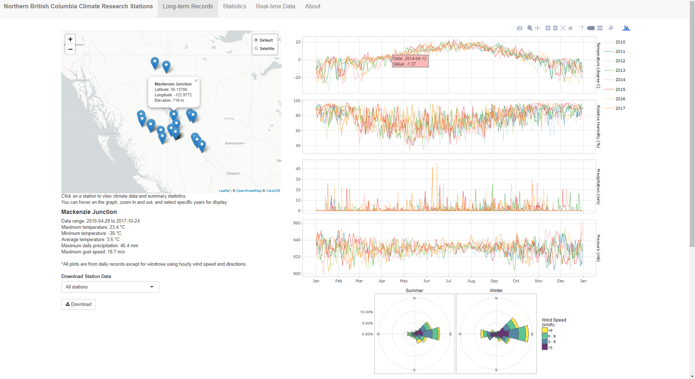
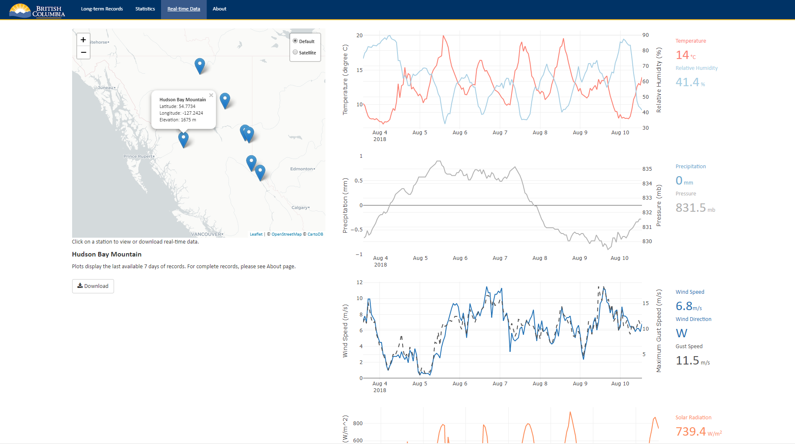

---
output:
  md_document:
    variant: markdown_github
---

```{r, echo = FALSE}
knitr::opts_chunk$set(
  collapse = TRUE,
  comment = "#>",
  fig.path = "README-"
)
```

<a id="devex-badge" rel="Exploration" href="https://github.com/BCDevExchange/assets/blob/master/README.md"></a>

# Northern B.C. Climate Research Stations

### Overview

A web-application for visualising and downloading Northern British Columbia climate research data.

### Features

Provides interactive web-application to view climate data station locations, visualise long-term and real-time records (including temperature, precipitation, wind, solar radiation etc), obtain statistical summaries and download data.

### Examples

Below are snapshots of the application showing long-term and real-time climate records.





### Annual Data Updates
Each year, weather station datasets are added to the application. The following contains notes on annual data updates.

1. New station data is provided as one comma separated value file (csv) for each station. The file contains all of the station's historical records up to date.
2. Scripts from `00_prep.R` to `04_output.R` under `R/` directory are run in four steps to integrate new station data to the application.
3. Once updated datasets are written to the `data/` folder, move them under `R/shiny/data` so the application contains updated datasets.
4. The hourly wind data (wind_df_{YYYY}.rds) contains the archived all stations' hourly wind dataframe required to output the windrose plots. Every year, this r binary file gets read in, updated with new hourly wind data. At the end of the update cycle, retain
a zipped file of it and commit to GitHub and remove the original .rds.
5. Remove raw data files and commit only station metadata (xlsx) and wind_df.zip to GitHub repository.

### Project Status

This project is updated annually with new weather station datasets.

### Getting Help or Reporting an Issue

To report bugs/issues/feature requests, please file an [issue](https://github.com/bcgov/nbcclim/issues/).

### How to Contribute

If you would like to contribute to the package, please see our 
[CONTRIBUTING](CONTRIBUTING.md) guidelines.

Please note that this project is released with a [Contributor Code of Conduct](CODE_OF_CONDUCT.md). By participating in this project you agree to abide by its terms.

### License

```
Copyright 2018 Province of British Columbia

Licensed under the Apache License, Version 2.0 (the "License");
you may not use this file except in compliance with the License.
You may obtain a copy of the License at

http://www.apache.org/licenses/LICENSE-2.0

Unless required by applicable law or agreed to in writing, software distributed under the License is distributed on an "AS IS" BASIS,
WITHOUT WARRANTIES OR CONDITIONS OF ANY KIND, either express or implied.
See the License for the specific language governing permissions and limitations under the License.
```

---
*This project was created using the [bcgovr](https://github.com/bcgov/bcgovr) package.* 
